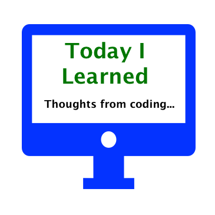

  

This is a scratchpad for quick notes and tips on what I am learning as I work and code.

-------------------------------------------------

## Social Media

- [Portfolio Site](https://edwardrutz.github.io)
- [Github Work](https://github.com/EdwardRutz)
- [Today I Learned Website](https://edwardrutz.github.io/TIL/)
- [LinkedIn: Edward Rutz](https://www.linkedin.com/in/edwardrutz/)
- [Twitter: @EdwardR](https://twitter.com/edwardr)

-------------------------------------------------

## CONTENTS
- [Recent Posts](#recent-posts)
- [Agile](#agile)
- [C#](#c)
- [Coding](#coding)
- [Glossary of Front-End Dev Terms](#glossary)
- [Productivity](#productivity)
- [React](#react)

-------------------------------------------------

## RECENT-POSTS

- [The Phoenix Project by Gene Kim](books/phoenix-project.md)
- [Kanban Introduction](kanban/kanban-intro.md)
- [Seven Habits of Succesful Developers](productivity/seven-habits-developers.md)
- [Easy C# Compiling on Mac with Mono Software](c-sharp/mono.md)
- [Seven Habits of Succesful Developers](productivity/seven-habits-developers.md)

-------------------------------------------------

## POSTS

### AGILE

### BOOKS
- [The Phoenix Project by Gene Kim](books/phoenix-project.md)

### C#

- [An Analogy for Namespace, Classes and Methods](c-sharp/namespace.md)
- [Easy C# Compiling on Mac with Mono Software](c-sharp/mono.md)

### CODING

- [What I Like About Coding](Coding/What-I-Like-About-Coding.md)

### GLOSSARY

- [Glossary of Front-End Dev Terms](glossary/glossary-front-end.md)

### PRODUCTIVTY

- [Seven Habits of Succesful Developers](productivity/seven-habits-developers.md)

### REACT

- [Serve, A Light-Weight Webserver](react/serve.md)
- [Easy, Breezy, Zero Config App](react/Easy-Breezy-Zero-Config-React-App.md)
- [Webpack Dev Server](react/Webpack-Dev-Server.md) 

## REFERENCES

- [Tyler's TIL](https://github.com/tylerb33/TIL)
- [Josh Branchaud's TIL](https://github.com/jbranchaud/til)

